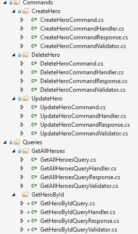

# Building A Succinct CQS Data Pipeline

The first time I came across CQS I though it was the answer to my issues with the Repository pattern.  My exitement quickly dissipated when I discovered how many classes I would neede to create to implement it.  My generic repository framework trumped it hands down.

I recently had cause to revisit CQS on an application re-write and decided to work on creating a more succinct version.  This article is about what I've managed to achieve.

## Test Data

There's a separate article in this series that describes the data store and pipeline used:

[The Weather Application Data Strore](./data.md)


## The CQS Pattern

CQS - not to be confused with CQRS - is fundimentally a programming style.  Every action is either:

1. A *Command* - a request to make a data change.
2. A *Query* - a request to get some data.

A *Command* returns either status information or nothing.  CQS defines it **NEVER** return a data set.

A *Query* returns a data set.  CQS defines it **NEVER** makes makes changes to the state of the data.  Ther are no **NO SIDE EFFECTS** to the owning object.

Good practice is to apply these rules to all object methods.  They make code more readable to the third person.

Smaller projects tend to avoid the CQS Data pipeline framework: it's seen as complicated because the demo implementations contain a lot of classes.

Each action has a *Command/Query* class that defines the action and a *Handler* class to execute the defined action.  Normally there's a one-to-one relationship:  a unique handler for every request.

In essence:

- A *Request* object defines the information a *Handler* needs to execute the request and what it expects in return - the *Result* .

- A *Handler* object executes the necessary code and returns the defined *Result* using data provided by the *Request*.  

Conceptually it's very simple, and relatively easy to implement.  The problem is most implementations are very verbose: lots of classes repeating the same old code.  Here's an example:



*Sincere apologies if you recognise this as your code!  I searched Google for an example and your article was high in the search results.*

It certainly scared me off when I first investigated CQS.  My `Repository` based generic solution had just a few classes.  Why go backwards, it made no sense.

This is an attempt to make it succinct!  I now use it over my generic repository code.

## Basic Interfaces and Classes

The basic methodology can be defined by two interfaces.

`ICQSRequest` defines any request:

1. It says the request produces an output defined as `TResult`.
2. It has a unique `TransactionId` to track the transaction (if required and implemented).

```csharp
public interface ICQSRequest<out TResult>
{
    public Guid TransactionId { get;}
}
```

`ICQSHandler` defines any handler that executes an `ICQSRequest` instance:

1. The handler gets a `TRequest` which implements the `ICQSRequest` interface.
2. The handler outputs a `TResult` as defined in the `ICQSRequest` interface.
3. It has a single `ExecuteAsync` method that returns `TResult`.

```csharp
public interface ICQSHandler<in TRequest, out TResult>
    where TRequest : ICQSRequest<TResult>
{
    TResult ExecuteAsync();
}
```

## A Classic Implementation

To demonstrate what I mean by "verbose", here's a classic implementation to add a `WeatherForecast` record.

`AddWeatherForecastCommand` is the request :

```csharp
public class AddWeatherForecastCommand
    : ICQSRequest<ValueTask<CommandResult>>
{
    public DboWeatherForecast Record { get; private set; } = default!;

    public AddWeatherForecastCommand(DboWeatherForecast record)
        => this.Record = record;
}
```

`AddWeatherForecastHandler` is the handler:

```csharp
public class AddWeatherForecastHandler
    : ICQSHandler<AddWeatherForecastCommand, ValueTask<CommandResult>>
{
    protected readonly IWeatherDbContext dbContext;
    protected readonly AddWeatherForecastCommand command;

    public AddWeatherForecastHandler(IWeatherDbContext dbContext, AddWeatherForecastCommand command)
    {
        this.command = command;
        this.dbContext = dbContext;
    }

    public async ValueTask<CommandResult> ExecuteAsync()
    {
        if (command.Record is not null)
            this.dbContext.DboWeatherForecast.Add(this.command.Record);

        return await dbContext.SaveChangesAsync() == 1
            ? new CommandResult(Guid.Empty, true, "Record Saved")
            : new CommandResult(Guid.Empty, false, "Error saving Record");
    }
}
```

Relatively small classes, but you need 3 sets (one each for add, update and delete) for each entity. That's 3 times *x* entities just for the commands.  The same principles apply to queries.  **DRY** hung out to dry!

## A Succinct Implementation

To build a more succinct implementation we need to accept:

 - The 80/20 rule.  Not every request can be fulfilled by our standard implementation.  We need a custom approach for these.
 - We need a "compliant" generics based ORM to interface with our data store.  This implementation uses *Entity Framework* which provides that. 
 - There will be some quite complicated generics implemented in the base classes.


## Results

Before diving into requests and handlers, we need a set of standard results they return: `TResult` of the request.  Each is defined a `record` containing status information and, if a request, the data set.  They are used in Web APIs so must be serializable.  They are shown below and need no explanation.

```csharp
public record ListProviderResult<TRecord>
{
    public IEnumerable<TRecord> Items { get; init; }
    public int TotalItemCount { get; init; }
    public bool Success { get; init; }
    public string? Message { get; init; }
    //....Constructors
}
```
```csaharp
public record RecordProviderResult<TRecord>
{
    public TRecord? Record { get; init; }
    public bool Success { get; init; }
    public string? Message { get; init; }
    //....Constructors
}
```
```csaharp
public record CommandResult
{
    public Guid NewId { get; init; }
    public bool Success { get; init; }
    public string Message { get; init; }
    //....Constructors
}
```
```csaharp
public record FKListProviderResult
{
    public IEnumerable<IFkListItem> Items { get; init; }
    public bool Success { get; init; }
    public string? Message { get; init; }
    //....Constructors
}
```

## Base Classes

`TRecord` represents the data classes retrieved from the data store using the ORM.  It's qualified as a `class` and implements an empty constructor `new()`.

### Commands

All commands:

1. Take a record which we define as `TRecord`.
2. Fix `TResult` as an async `Task<CommandResult>`.

First an interface that implements `ICQSRequest` and this functionality.

```csharp
public interface IRecordCommand<TRecord> 
    : ICQSRequest<ValueTask<CommandResult>>
{
    public TRecord Record { get;}
}
```

And an abstract implementation.

```csharp
public abstract class RecordCommandBase<TRecord>
     : IRecordCommand<TRecord>
{
    public Guid TransactionId { get; } = Guid.NewGuid(); 
    public TRecord Record { get; protected set; } = default!;

    public RecordCommandBase(TRecord record)
        => this.Record = record;
}
```

We can now define our Add/Delete/Update specific commands.

```csharp
public class AddRecordCommand<TRecord>
     : RecordCommandBase<TRecord>
{
    public AddRecordCommand(TRecord record) : base(record) {}
}
```
```csharp
public class DeleteRecordCommand<TRecord>
     : RecordCommandBase<TRecord>
{
    public DeleteRecordCommand(TRecord record) : base(record) {}
}
```
```csharp
public class UpdateRecordCommand<TRecord>
     : RecordCommandBase<TRecord>
{
    public UpdateRecordCommand(TRecord record) : base(record) {}
}
```

We need a one-to-one relationship (requests -> handlers) so we define a handler for each type of command.

### The Handlers

There's no benefit in creating interfaces or base classes for handlers so we implement Create/Update/Delete commands as three separate classes.  `TRecord` defines the record class and `TDbContext` the `DbContext` used in the DI `DbContextFactory`.

We use the built in generic methods in `DbContext`, so don't need the specific `DbContext`.   `Set<TRecord>` method finds the `DbSet` instances of `TRecord` and `Update<TRecord>`, `Add<TRecord>` and `Delete<TRecord>` methods with `SaveChangesAsync` implement the commands. 

All the handlers follow the same pattern.

1. The constructor passes in the DbContext factory and the command request to execute.
2. `Execute`:
   1. Gets a DbContext.
   2. Calls the generic `Add/Update/Delete` on the context passing in the record.  Internally EF finds the recordset and the specific record and replaces it with the one supplied.
   3. Calls `SaveChanges` on the DbContext that commits the changes to the data store.
   4. Checks we have one change and returns a `CommandResult`.

This is the Add Handler:

```csharp
public class AddRecordCommandHandler<TRecord, TDbContext>
    : ICQSHandler<AddRecordCommand<TRecord>, ValueTask<CommandResult>>
    where TDbContext : DbContext
    where TRecord : class, new()
{
    protected IDbContextFactory<TDbContext> factory;
    protected readonly AddRecordCommand<TRecord> command;

    public AddRecordCommandHandler(IDbContextFactory<TDbContext> factory, AddRecordCommand<TRecord> command)
    {
        this.command = command;
        this.factory = factory;
    }

    public async ValueTask<CommandResult> ExecuteAsync()
    {
        using var dbContext = factory.CreateDbContext();
        dbContext.Add<TRecord>(command.Record);
        return await dbContext.SaveChangesAsync() == 1
            ? new CommandResult(Guid.Empty, true, "Record Saved")
            : new CommandResult(Guid.Empty, false, "Error saving Record");
    }
}
``` 

## The Generic Factory Broker

We can now define a factory interface and class to abstract the execution of *Requests* against their respective *Handlers*.  Personal: I always call these Core -> Data domain interfaces *Brokers*.

The interface:

```csharp
public interface ICQSDataBroker
{
    public ValueTask<CommandResult> ExecuteAsync<TRecord>(AddRecordCommand<TRecord> command) where TRecord : class, new();
    public ValueTask<CommandResult> ExecuteAsync<TRecord>(UpdateRecordCommand<TRecord> command) where TRecord : class, new();
    public ValueTask<CommandResult> ExecuteAsync<TRecord>(DeleteRecordCommand<TRecord> command) where TRecord : class, new();
    //.... other ExecuteAsyncs
    public ValueTask<object> ExecuteAsync<TRecord>(object query);
}
```
The server implementation, which maps the request to the associated handler.

```csharp
public class CQSDataBroker<TDbContext>
    :ICQSDataBroker
    where TDbContext : DbContext
{
    private readonly IDbContextFactory<TDbContext> _factory;

    public CQSDataBroker(IDbContextFactory<TDbContext> factory)
        => _factory = factory;

    public async ValueTask<CommandResult> ExecuteAsync<TRecord>(AddRecordCommand<TRecord> command) where TRecord : class, new()
    {
        var handler = new AddRecordCommandHandler<TRecord, TDbContext>(_factory, command);
        var result = await handler.ExecuteAsync();
        return result;
    }

    //.... Update and Delete ExecuteAsyncs

    //.... other ExecuteAsyncs

    public ValueTask<object> ExecuteAsync<TRecord>(object query)
        => throw new NotImplementedException();
}
```

The WASM API implementation:

```csharp
public class CQSAPIDataBroker
    :ICQSDataBroker
{
    private HttpClient _httpClient;
    private ICQSAPIListHandlerFactory _CQSAPIListHandlerFactory;

    public CQSAPIDataBroker(HttpClient httpClient, ICQSAPIListHandlerFactory cQSAPIListHandlerFactory )
    { 
        _httpClient = httpClient;
        _CQSAPIListHandlerFactory = cQSAPIListHandlerFactory ;
    }

    public async ValueTask<CommandResult> ExecuteAsync<TRecord>(AddRecordCommand<TRecord> command) where TRecord : class, new()
    {
        CommandResult? result = null;

        var entityname = (new TRecord()).GetType().Name;
        var response = await _httpClient.PostAsJsonAsync<AddRecordCommand<TRecord>>($"/api/{entityname}/addrecordcommand", command);

        if (response.IsSuccessStatusCode)
            result = await response.Content.ReadFromJsonAsync<CommandResult>();

        return result ?? new CommandResult();
    }

    //.... Update and Delete ExecuteAsyncs

    //.... other ExecuteAsyncs

    public ValueTask<object> ExecuteAsync<TRecord>(object query)
        => throw new NotImplementedException();
}
```

We can now call `ExecuteAsync` on the broker, setting `TRecord` and passing it the relevant command and it will execute the associated handler.

```
var command = new UpdateRecordCommand<DboWeatherForecast>(editedRecord);
var result = await broker.ExecuteAsync(command);
```


## Queries

Moving on to queries which aren't quite so uniform.

1. There are various types of `TResult`.
2. They have specific *Where* and *OrderBy* requirements.

To handle these requirements we define three Query requests:

### RecordQuery

This returns a `RecordProviderResult` containing a single record based on a provided Uid.

```csharp
public record RecordQuery<TRecord>
    : ICQSRequest<ValueTask<RecordProviderResult<TRecord>>>
{
    public Guid TransactionId { get; } = Guid.NewGuid();
    public readonly Guid? RecordId;

    public RecordQuery(Guid? recordId)
        => this.RecordId = recordId;
}
```

### ListQuery

This returns a `ListProviderResult` containing a *paged* `IEnumerable` of `TRecord`.

We define an interface:

```
public interface IListQuery<TRecord>
    : ICQSRequest<ValueTask<ListProviderResult<TRecord>>>
    where TRecord : class, new()
{
    public int StartIndex { get; }
    public int PageSize { get; }
    public string? SortExpressionString { get; }
    public string? FilterExpressionString { get; }
}
```

A base abstract implementation:

```csharp
public abstract record ListQueryBase<TRecord>
    :IListQuery<TRecord>
    where TRecord : class, new()
{
    public int StartIndex { get; init; }
    public int PageSize { get; init; }
    public string? SortExpressionString { get; init; }
    public string? FilterExpressionString { get; init; }
    public Guid TransactionId { get; init; } = Guid.NewGuid();

    public ListQueryBase() { }

    public ListQueryBase(ListProviderRequest<TRecord> request)
    {
        this.StartIndex = request.StartIndex;
        this.PageSize = request.PageSize;
        this.SortExpressionString = request.SortExpressionString;
        this.FilterExpressionString = request.FilterExpressionString;
    }
}
```

And finally a generic query:

```csharp
public record ListQuery<TRecord>
    :ListQueryBase<TRecord>
    where TRecord : class, new()
{
    public ListQuery() { }

    public ListQuery(ListProviderRequest<TRecord> request)
        :base(request) { }
}
```

We use the interface/abstract base class pattern because we need to implement custom List queries.  If these inherit from `ListQuery`, we run into issues with factories and pattern methods.  Using a base class to implement the bolierplate code solves this problem.

### FKListQuery

This returns a `FkListProviderResult` containing an `IEnumerable` of `IFkListItem`.  `FkListItem` is a simple object containing a *Guid/Name* pair.  It's principle use is in foreign key *Select* controls in the UI.

```csharp
public record FKListQuery<TRecord>
    : ICQSRequest<ValueTask<FKListProviderResult>>
{
    public Guid TransactionId { get; } = Guid.NewGuid();
}
```

## Handlers

The corresponding query handlers are:

### RecordQueryHandler

Creatinge a "generic" version can be challenging depending on the ORM.

The key concepts to note are:

1. The use of *unit of work* `DbContexts` from the `IDbContextFactory`.
2. `_dbContext.Set<TRecord>()` gets the `DbSet` for `TRecord`.
3. The use of two methodologies to apply the query.  

```csharp
public class RecordQueryHandler<TRecord, TDbContext>
    : ICQSHandler<RecordQuery<TRecord>, ValueTask<RecordProviderResult<TRecord>>>
        where TRecord : class, new()
        where TDbContext : DbContext
{
    private readonly RecordQuery<TRecord> _query;
    private IDbContextFactory<TDbContext> _factory;
    private bool _success = true;
    private string _message = string.Empty;

    public RecordQueryHandler(IDbContextFactory<TDbContext> factory, RecordQuery<TRecord> query)
    {
        _factory = factory;
        _query = query;
    }

    public async ValueTask<RecordProviderResult<TRecord>> ExecuteAsync()
    {
        var dbContext = _factory.CreateDbContext();
        dbContext.ChangeTracker.QueryTrackingBehavior = QueryTrackingBehavior.NoTracking;

        TRecord? record = null;

        // first check if the record implements IRecord.  If so we can do a cast and then do the query via the Uid property directly 
        if ((new TRecord()) is IRecord)
            record = await dbContext.Set<TRecord>().SingleOrDefaultAsync(item => ((IRecord)item).Uid == _query.GuidId);

        // Try and use the EF FindAsync implementation
        if (record == null)
        {
            if (_query.GuidId != Guid.Empty)
                record = await dbContext.FindAsync<TRecord>(_query.GuidId);

            if (_query.LongId > 0)
                record = await dbContext.FindAsync<TRecord>(_query.LongId);

            if (_query.IntId > 0)
                record = await dbContext.FindAsync<TRecord>(_query.IntId);
        }

        if (record is null)
        {
            _message = "No record retrieved";
            _success = false;
        }

        return new RecordProviderResult<TRecord>(record, _success, _message);
    }
}
```

### ListQueryHandler

The key concepts to note here are:

1. The use of *unit of work* `DbContexts` from the `IDbContextFactory`.
2. `_dbContext.Set<TRecord>()` to get the `DbSet` for `TRecord`.
3. The use of `IQueryable` to build queries.
4. The need for two queries.  One to get the "paged" recordset and one to get the total record count.

```csharp
public class ListQueryHandler<TRecord, TDbContext>
    : IListQueryHandler<TRecord>
        where TDbContext : DbContext
        where TRecord : class, new()
{
    protected IEnumerable<TRecord> items = Enumerable.Empty<TRecord>();
    protected int count = 0;

    protected IDbContextFactory<TDbContext> factory;
    protected IListQuery<TRecord> listQuery = default!;

    public ListQueryHandler(IDbContextFactory<TDbContext> factory)
    {
        this.factory = factory;
    }

    public ListQueryHandler(IDbContextFactory<TDbContext> factory, IListQuery<TRecord> query)
    {
        this.factory = factory;
        this.listQuery = query;
    }

    public async ValueTask<ListProviderResult<TRecord>> ExecuteAsync()
    {
        if (this.listQuery is null)
            return new ListProviderResult<TRecord>(new List<TRecord>(), 0, false, "No Query Defined");

        if (await this.GetItemsAsync())
            await this.GetCountAsync();

        return new ListProviderResult<TRecord>(this.items, this.count);
    }

    public async ValueTask<ListProviderResult<TRecord>> ExecuteAsync(IListQuery<TRecord> query)
    {
        if (query is null)
            return new ListProviderResult<TRecord>(new List<TRecord>(), 0, false, "No Query Defined");

        listQuery = query;

        if (await this.GetItemsAsync())
            await this.GetCountAsync();

        return new ListProviderResult<TRecord>(this.items, this.count);
    }

    protected virtual async ValueTask<bool> GetItemsAsync()
    {
        var dbContext = this.factory.CreateDbContext();
        dbContext.ChangeTracker.QueryTrackingBehavior = QueryTrackingBehavior.NoTracking;

        IQueryable<TRecord> query = dbContext.Set<TRecord>();

        if (listQuery.FilterExpressionString is not null)
            query = query
                .Where(listQuery.FilterExpressionString)
                .AsQueryable();

        if (listQuery.SortExpressionString is not null)
            query = query.OrderBy(listQuery.SortExpressionString);

        if (listQuery.PageSize > 0)
            query = query
                .Skip(listQuery.StartIndex)
                .Take(listQuery.PageSize);

        if (query is IAsyncEnumerable<TRecord>)
            this.items = await query.ToListAsync();
        else
            this.items = query.ToList();

        return true;
    }

    protected virtual async ValueTask<bool> GetCountAsync()
    {
        var dbContext = this.factory.CreateDbContext();
        dbContext.ChangeTracker.QueryTrackingBehavior = QueryTrackingBehavior.NoTracking;

        IQueryable<TRecord> query = dbContext.Set<TRecord>();

        if (listQuery.FilterExpressionString is not null)
            query = query
                .Where(listQuery.FilterExpressionString)
                .AsQueryable();

        if (query is IAsyncEnumerable<TRecord>)
            count = await query.CountAsync();
        else
            count = query.Count();

        return true;
    }
}
```

### FKListQueryHandler

```csharp
public class FKListQueryHandler<TRecord, TDbContext>
    : ICQSHandler<FKListQuery<TRecord>, ValueTask<FKListProviderResult>>
        where TDbContext : DbContext
        where TRecord : class, IFkListItem, new()
{
    protected IEnumerable<TRecord> items = Enumerable.Empty<TRecord>();
    protected IDbContextFactory<TDbContext> factory;
    protected readonly FKListQuery<TRecord> listQuery;

    public FKListQueryHandler(IDbContextFactory<TDbContext> factory, FKListQuery<TRecord> query)
    {
        this.factory = factory;
        this.listQuery = query;
    }

    public async ValueTask<FKListProviderResult> ExecuteAsync()
    {
        var dbContext = this.factory.CreateDbContext();
        if (listQuery is null)
            return new FKListProviderResult(Enumerable.Empty<IFkListItem>(), false, "No Query defined");

        IEnumerable<TRecord> dbSet = await dbContext.Set<TRecord>().ToListAsync();
        return new FKListProviderResult(dbSet);
    }
}
```

## The Generic Factory Broker Methods

Having defined our Requests/Handlers in one-to-one relationships we can now define the factory methods to abstract the execution of *Requests* against their respective *Handlers*.

The interface methods:

```csharp
public interface ICQSDataBroker
{
    public ValueTask<ListProviderResult<TRecord>> ExecuteAsync<TRecord>(ListQuery<TRecord> query) where TRecord : class, new();
    public ValueTask<RecordProviderResult<TRecord>> ExecuteAsync<TRecord>(RecordQuery<TRecord> query) where TRecord : class, new();
    public ValueTask<FKListProviderResult> ExecuteAsync<TRecord>(FKListQuery<TRecord> query) where TRecord : class, IFkListItem, new();
}
```

And the Server broker methods.

```csharp
public class CQSDataBroker<TDbContext>
    :ICQSDataBroker
    where TDbContext : DbContext
{
    private readonly IDbContextFactory<TDbContext> _factory;
    private readonly IServiceProvider _serviceProvider;

    public CQSDataBroker(IDbContextFactory<TDbContext> factory, IServiceProvider serviceProvider)
    { 
        _factory = factory;
        _serviceProvider = serviceProvider;
    }

    public async ValueTask<ListProviderResult<TRecord>> ExecuteAsync<TRecord>(ListQuery<TRecord> query) where TRecord : class, new()
    {
        var handler = new ListQueryHandler<TRecord, TDbContext>(_factory, query);
        var result = await handler.ExecuteAsync();
        return result;
    }

    public async ValueTask<RecordProviderResult<TRecord>> ExecuteAsync<TRecord>(RecordQuery<TRecord> query) where TRecord : class, new()
    {
        var handler = new RecordQueryHandler<TRecord, TDbContext>(_factory, query);
        var result = await handler.ExecuteAsync();
        return result;
    }

    public async ValueTask<FKListProviderResult> ExecuteAsync<TRecord>(FKListQuery<TRecord> query) where TRecord : class, IFkListItem, new()
    {
        var handler = new FKListQueryHandler<TRecord, TDbContext>(_factory, query);
        var result = await handler.ExecuteAsync();
        return result;
    }
    //.... other ExecuteAsyncs

    public ValueTask<object> ExecuteAsync<TRecord>(object query)
        => throw new NotImplementedException();
}
```

And the API broker:

```csharp
public class CQSAPIDataBroker
    :ICQSDataBroker
{
    private HttpClient _httpClient;
    private ICQSAPIListHandlerFactory _CQSAPIListHandlerFactory;

    public CQSAPIDataBroker(HttpClient httpClient, ICQSAPIListHandlerFactory cQSAPIListHandlerFactory )
    { 
        _httpClient = httpClient;
        _CQSAPIListHandlerFactory = cQSAPIListHandlerFactory ;
    }

    public async ValueTask<ListProviderResult<TRecord>> ExecuteAsync<TRecord>(ListQuery<TRecord> query) where TRecord : class, new()
    {
        ListProviderResult<TRecord>? result = null;

        var entityname = (new TRecord()).GetType().Name;
        var response = await _httpClient.PostAsJsonAsync<ListQuery<TRecord>>($"/api/{entityname}/listquery", query);

        if (response.IsSuccessStatusCode)
            result = await response.Content.ReadFromJsonAsync<ListProviderResult<TRecord>>();

        return result ?? new ListProviderResult<TRecord>();
    }

    public async ValueTask<RecordProviderResult<TRecord>> ExecuteAsync<TRecord>(RecordQuery<TRecord> query) where TRecord : class, new()
    {
        RecordProviderResult<TRecord>? result = null;

        var entityname = (new TRecord()).GetType().Name;
        var response = await _httpClient.PostAsJsonAsync<RecordQuery<TRecord>>($"/api/{entityname}/recordquery", query);

        if (response.IsSuccessStatusCode)
            result = await response.Content.ReadFromJsonAsync<RecordProviderResult<TRecord>>();

        return result ?? new RecordProviderResult<TRecord>();
    }

    public async ValueTask<FKListProviderResult> ExecuteAsync<TRecord>(FKListQuery<TRecord> query) where TRecord : class, IFkListItem, new()
    {
        FKListProviderResult? result = null;

        var entityname = (new TRecord()).GetType().Name;
        var response = await _httpClient.PostAsJsonAsync<FKListQuery<TRecord>>($"/api/{entityname}/fklistquery", query);

        if (response.IsSuccessStatusCode)
            result = await response.Content.ReadFromJsonAsync<FKListProviderResult>();

        return result ?? new FKListProviderResult();
    }

    //.... other ExecuteAsyncs

```

### Custom List Queries

As I mentioned above, we need to handle custom list queries.

```csharp
public interface ICQSDataBroker
{
    public ValueTask<ListProviderResult<TRecord>> ExecuteAsync<TRecord>(IListQuery<TRecord> query) where TRecord : class, new();
}
```

```csharp
public class CQSDataBroker<TDbContext>
    :ICQSDataBroker
    where TDbContext : DbContext
{
    private readonly IDbContextFactory<TDbContext> _factory;
    private readonly IServiceProvider _serviceProvider;

    public CQSDataBroker(IDbContextFactory<TDbContext> factory, IServiceProvider serviceProvider)
    { 
        _factory = factory;
        _serviceProvider = serviceProvider;
    }

    public async ValueTask<ListProviderResult<TRecord>> ExecuteAsync<TRecord>(IListQuery<TRecord> query) where TRecord : class, new()
    {
        var queryType = query.GetType();
        var handler = _serviceProvider.GetService<IListQueryHandler<TRecord>>();
        if (handler == null)
            throw new NullReferenceException("No Handler service registed for the List Query");

        var result = await handler.ExecuteAsync(query);
        return result;
    }
    //.... other ExecuteAsyncs
}
```

And the API broker:

```csharp
public class CQSAPIDataBroker
    :ICQSDataBroker
{
    private HttpClient _httpClient;
    private ICQSAPIListHandlerFactory _CQSAPIListHandlerFactory;

    public CQSAPIDataBroker(HttpClient httpClient, ICQSAPIListHandlerFactory cQSAPIListHandlerFactory )
    { 
        _httpClient = httpClient;
        _CQSAPIListHandlerFactory = cQSAPIListHandlerFactory ;
    }

    public async ValueTask<ListProviderResult<TRecord>> ExecuteAsync<TRecord>(IListQuery<TRecord> query) where TRecord : class, new()
        => await _CQSAPIListHandlerFactory.ExecuteAsync(query);

    //.... other ExecuteAsyncs

```


