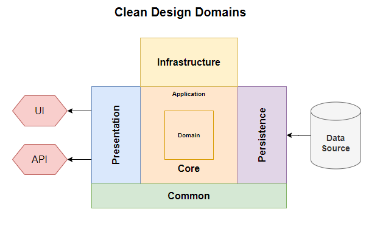

# Solution Architecture and Design

## Clean Design

Clean Design is a modern software design architecture appropriate for Web based projects.  Implementing it in solutioins is neither heavy duty nor requires a training course to understand and implement.

It's core principles are:
1. Separation of Concerns.
2. The Dependancy Rule.  

Clean design can be visualized as a set of concentric rings with domains representing the primary coencerns.  Dependencies flow inward: a domain can have no dependencies on a domain in an outer ring or a domain in the same ring.  The diagram below shows the principle rings.



In smaller projects the domain and application rings are often combined into a single core ring.

### Dependency Injection and Abstraction

The glue that makes Clean Design possible is abstraction and dependency injection.

1. Abstraction is the process of defining connections between domains as interfaces.
2. Dependency Injection is software framework that manages the lifecycle of object instances within a DI container.   

It's easier to demonstrate the principles in a simple example that try to provide a detailed explanation.

We can refactor some of the Blazor Server Template code for `WeatherForecast` and `FetchData`.

`FetchData` requires a collection of WeatherForecasts.  We can define a View interface to encapsulate that functionality.

```csharp
public interface IWeatherForecastView
{
    public IEnumerable<WeatherForecast> WeatherForecasts {get;}
    public void GetWeatherForecasts();
}
```

And implement a class version of that interface:

```csharp
public class WeatherForecastView : IWeatherForecastService
{
    public IEnumerable<WeatherForecast> WeatherForecasts {get; private set;} = new List<WeatherForecast>();
    
    public void GetWeatherForecasts()
    {
        // Go away and get the data
        // assign to this.WeatherForecasts 
    }
}
```

This can be registered in the DotNetCore Dependency Injection container in `Program`:

```csharp
builder.Services.AddScoped<IWeatherForecastView, WeatherForecastView>();
```

Note that the registration is as `IWeatherForecastView`.  

`FetchData` can now use it by injection of `IWeatherForecastView`

```csharp
@inject IWeatherForecastView

//show as table IWeatherForecastView.WeatherForecasts
```

We have abstracted the core domain View from the UI domain.  All UI interaction with the view class is through the interface.  We can register a different `IWeatherForecastView` implementation class in the services container and the UI dosen't need to know or care about the difference.  It will work with any class that implements the `IWeatherForecastView` interface.

The separation of concerns principles are enforced through projects and project dependancies.  All the application code resides in libraries.  The applications, in this case Blazor Server and Blazor WASM SPAs, are endpoints.

## Entity Domains

The primary organisation of the solution is on separation of concerns.  The secondary organisation is on entities.  You will see an *Entities* folder in each domain.  An *entity* is a dataset or other logical grouping of code.  In this application the only entity is *WeatherForcasts*.  The *Base* entity contains all the non-specific code, such as interfaces and generic abstract classes. 

## Coding Standards

I (try to) implement good code practices throughout the solution: principally SOLID and basic CQS principles in classes.  I use coding patterns where appropiate.

## Generics and Boilerplating

Using Generics we can boilerplate code.  A common design pattern is:

1. An `interface` to define the common functionality and abstraction.
2. An `abstract` base class that implements the interface functionality using generics.
3. Concrete implementation class that simply fix the generics and inherit their functionality from the base class.

One interface, one abstract class, many concrete implementations.

View Services demonstrate this pattern.  The concrete `WeatherForecastViewService` looks like this:

```csharp
public class WeatherForecastViewService : ViewServiceBase<WeatherForecast>
{
    public WeatherForecastViewService(IDataBroker dataBroker)
        : base(dataBroker)
    { }
}
```

A concrete class that fixes `TRecord` and a constructor.

## Database Access

I use ORMs [Object-Relational Mapper] to simplify database access.  In this project I've stuck with mainstream Entity Framework, but could have used Dapper or Linq2DB.

There's no classic Repository pattern implementation.  I've implemented two alternatives.

1. Generic Data Broker.  This is a relative of the Repository pattern.  It uses method based generics to remove repetition - a drawback of the repository pattern.  There's one data broker service handles CRUD and List operations for all data sets.

2. A Command/Query entity based pattern.  This is more complex than the generic data broker.  It's overkill for a simple project.  It'a place is in larger projects with larger more complex data pipelines.

I use both patterns in a project.  The Data Broker pattern is used for all bulk standard CRUD and list operations: no extensions allowed.  The CQS pattern is used for all custom operations. 

**A note on ORMs and EF.**
  
I keep EF simple and treat it as a standard ORM.  `DataSets` map directly to database tables and views: no relationship building.  Clean design dictates the relationships between data objects is part of the application/business logic and belongs in the core domain, definitley not the Data layer!

## Immutable Records

You will see most data classes defined as `record` in the solution. All data retrieved from the database is treated as immutable.  The application builds editable classes for edit forms and then submits new records back to the database to update/add records.  Editable classes are responsible for data validation. 