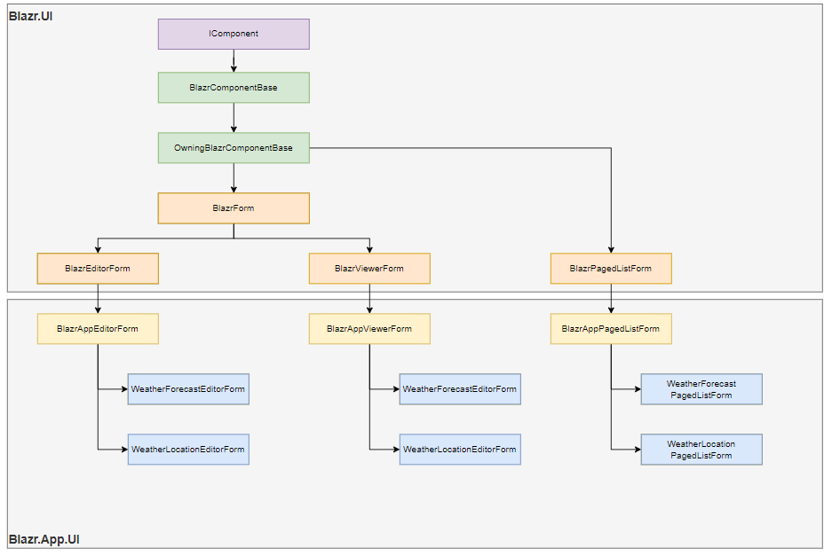

# Forms

Forms are a top level design component in the UI.  This is a typical form - it's the viewer for Weather Locations.  It implements boilerplate code in abstract base classes and templated components.

```csharp
@namespace Blazr.App.UI
@inherits BlazrAppViewerForm<DboWeatherLocation, WeatherLocationEntity>
<UIContainer Size=BootstrapSize.Fluid>
    <UIFormRow>
        <UIColumn Columns=12 MediumColumns=6>
            <FormViewControl Label="Location" Value="this.Service.Record!.Location" ControlType="typeof(InputReadOnlyDisplay)" />
        </UIColumn>
        <UIColumn Columns=12 MediumColumns=6>
            <FormViewControl Label="Unique Record Identity" Value="this.Service.Record!.Uid" ControlType="typeof(InputReadOnlyDisplay)" />
        </UIColumn>
    </UIFormRow>
</UIContainer>

@code {
    protected override RenderFragment BaseContent => (builder) => base.BuildRenderTree(builder);
}
```

It inherits from a base form `BlazrAppViewerForm` that contains all the functionality.  It only contains component controls, no markup.

The View form is the simplest of the main forms so we'll look at it in detail.

## Forms Inheritance

The diagram below shows the inheritance structure of the Form components.



### Blazr Form
 
This is the base view and edit form.  It contains the shared functionality.

```csharp
public abstract class BlazrForm<TService, TEntity>
    : BlazrOwningComponentBase<TService>, IDisposable, IHandleEvent, IHandleAfterRender
    where TService : class
    where TEntity : class, IEntity
{
    protected bool isNew = true;
    protected string FormTitle = "Record Viewer";
```

It's based on generics:

 - `TService` is the edot or view service for the component.
 - `TEntity` is the entity that `TRecord` belongs to.


All the required services are injected:

```csharp
    [Inject] protected NavigationManager NavManager { get; set; } = default!;
    [Inject] protected ModalService ModalService { get; set; } = default!;
    [Inject] protected INotificationService<TEntity> NotificationService { get; set; } = default!;
    [Inject] protected IEntityService<TEntity> EntityService { get; set; } = default!;
    [Inject] protected IEntityUIService<TEntity> EntityUIService { get; set; } = default!;
    [Inject] protected IServiceProvider SPAServiceProvider { get; set; } = default!;
```

There are set of methods to handle form exiting from a modal or page context.

The form defines a simply event hander and turns off the after render handlers.


### Blazr View Form
 
This is the base form.  It contains most of the code.

```csharp
public abstract class BlazrViewerForm<TRecord, TEntity>
    : BlazrOwningComponentBase<IReadService<TRecord, TEntity>>, IDisposable
    where TRecord : class, new()
    where TEntity : class, IEntity
```

It's based on generics:

 - `TRecord` is the record we want to display.
 - `TEntity` is the entity that `TRecord` belongs to.

The component inherits from `BlazrOwningComponentBase` with `IReadService<TRecord, TEntity>` defined as the `Service`.

It's important to understand that `IReadService<TRecord, TEntity>` is the DI registered service whose uniqueness is fixed by `Trecord` and `TEntity`, and that using `BlazrOwningComponentBase` restricts it's scope to the form's lifetime.  There are complications which will be discussed shortly.

You can find the service declared in `AddWeatherLocationServices`:

```
services.AddScoped<IListService<DboWeatherLocation, WeatherLocationEntity>, StandardListService<DboWeatherLocation, WeatherLocationEntity>>();
```

We also implement `IDisposable` as we are registering with the entity notification service for record change events.

##### Services

The Form injects all the services it needs:

```csharp
    [Inject] protected NavigationManager NavManager { get; set; } = default!;
    [Inject] protected ModalService ModalService { get; set; } = default!;
    [Inject] protected INotificationService<TEntity> NotificationService { get; set; } = default!;
    [Inject] protected IEntityService<TEntity> EntityService { get; set; } = default!;
    [Inject] protected IEntityUIService<TEntity> EntityUIService { get; set; } = default!;
    [Inject] protected IServiceProvider SPAServiceProvider { get; set; } = default!;
```

Note the use of `= default!;` to override nullable errors.  No service will be null beyond initialisation: the runtime will throw an exception if it can't find a required service.

Using `BlazrOwningComponentBase` the *Service* service is scoped to the component container.  Any services that service *injects* on initialization will also be scoped to the component container.

This is the `StandardReadService` new method:

```csharp
    public StandardReadService(ICQSDataBroker dataBroker, INotificationService<TEntity> notifier, AuthenticationStateProvider authenticationState, IAuthorizationService authorizationService)
        : base(dataBroker, notifier, authenticationState, authorizationService)
    { }
```

`ICQSDataBroker dataBroker` is singleton so will use the main containers instance, but all the others are scoped.  The component container will create new "isolated" instances which are not the instances we want.

We solve this problem with the `SetServices` method in `StandardReadService`.  It's passed a  `IServiceProvider` instance which is uses to assign the correct service instances.

```csharp
    public void SetServices(IServiceProvider services)
    {
        this.Notifier = services.GetService(typeof(INotificationService<TEntity>)) as INotificationService<TEntity> ?? default!;
        this.AuthenticationStateProvider = services.GetService(typeof(AuthenticationStateProvider)) as AuthenticationStateProvider ?? default!;
        this.AuthorizationService = services.GetService(typeof(IAuthorizationService)) as IAuthorizationService ?? default!;
    }
```

You can see this called in `BlazorViewerForm` where it's passed the SPA ServiceProvider instance.

```csharp
public override async Task SetParametersAsync(ParameterView parameters)
{
    if (_isNew)
        // ...
        this.Service.SetServices(SPAServiceProvider);
        // ...
}
```

##### SetParametersAsync

`SetParametersAsync` is overridden to add new functionality.  We've already seen setting the Services.  It adds two lifecycle methods that run before `OnInitialized{Async}`:

1. `PreLoadRecordAsync` is called before the record is loaded.
2. `LoadRecordAsync` loads the record.

THe two are added to keep `OnInitialized{Async}` clean.  It can be used in implementations without worrying about whether and when you need to call the base method.  The abstract form components implement their functionality outside the standard `OnInitialized{Async}` and `OnParametersSet{Async}` lifecycle methods.

```csharp
public override async Task SetParametersAsync(ParameterView parameters)
{
    // Applies the component parameter changes
    parameters.SetParameterProperties(this);

    if (_isNew)
    {
        // Get the Title for the form
        if (!string.IsNullOrWhiteSpace(this.EntityUIService.SingleTitle))
            this.FormTitle = $"{this.EntityUIService.SingleTitle} Viewer";

        // We're using Owning so creating our own services container for our Read Service
        // This service needs access to the SPA's Scoped services.  So calling this method on the service
        // sets those services to the correct SPA level instances of those objects
        this.Service.SetServices(SPAServiceProvider);

        // Loads the record
        await PreLoadRecordAsync();
        await this.LoadRecordAsync();

        // Sets up the evnt handler for record changes
        this.NotificationService.RecordChanged += OnChange;
    }

    // Calls the base version.
    // This does all the usual ComponentBase OnInitialized{Async} and OnParametersSet{Async} stuff
    await base.SetParametersAsync(ParameterView.Empty);

    // We aren't new any more
    _isNew = false;
}
```

The rest of the code is standard fare.

## BlazrAppViewerForm

This is the application abstract implementation that sets up the base template.

The Razor code:

```csharp
@typeparam TRecord where TRecord : class, new()
@typeparam TEntity where TEntity  : class, IEntity
@inherits BlazrViewerForm<TRecord, TEntity>

<UIContainer Size=BootstrapSize.Fluid class="@this.ContainerCss">
        <FormViewTitle>
            @this.FormTitle
        </FormViewTitle>
        <UIContainer Size=BootstrapSize.Fluid>
            <UIFormRow>
                <UIColumn Columns=12 class="text-end text-right mt-2">
                    <UIAuthorizeButton Policy=@AppAuthorizationPolicies.IsEditorPolicy AuthFields="this.GetAuthFields(Service.Record)" type="button" ButtonType=UIButtonType.Edit
                                                ClickEvent=this.EditRecordAsync>Edit</UIAuthorizeButton>
                    <UIButton ButtonType=UIButtonType.Exit ClickEvent=this.Exit>Exit</UIButton>
                </UIColumn>
            </UIFormRow>
        </UIContainer>
    <UILoader State="this.LoadState">
        @this.FormContent
    </UILoader>
</UIContainer>
``` 

Note `@this.FormContent` towards the end.  This is similar to a layout.  The implemented form renders in `@this.FormContent`.

The partial class:

```csharp
public abstract partial class BlazrAppViewerForm<TRecord, TEntity>
    : BlazrViewerForm<TRecord, TEntity>
    where TRecord : class, new()
    where TEntity : class, IEntity
{
    protected string ContainerCss => this.Modal is null
        ? "p-2 bg-light border border-brand mt-2"
        : "p-2 bg-light";

    protected RenderFragment? FormContent => (builder) => this.BuildRenderTree(builder);
    protected RenderFragment? TemplateContent { get; set; }

    public BlazrAppViewerForm()
    {
        componentRenderFragment = builder =>
        {
            hasPendingQueuedRender = false;
            hasNeverRendered = false;
            TemplateContent.Invoke(builder);
        };
    }

    protected virtual AppAuthFields GetAuthFields(TRecord? record)
    => new AppAuthFields { OwnerId = (record as IAuthRecord)?.OwnerId ?? Guid.Empty };
}
```

The templating works by reconfiguring `componentRenderFragment` which is the `RenderFragment` that represents the component content.  The Razor compiler builds the razor content into `BuildRenderTree`.  By default this method is called by `componentRenderFragment` to build the component's UI content.  We change that.

First, we assign the `BuildRenderTree` to a new render fragment called `FormContent`.  If you look back up at the Razor code that's the content render fragment.

Next we create a new `RenderFragment` called `TemplateContent`. This gets assigned in the child implementations.

Next we override the new method and build a new version of `componentRenderFragment`.   This one uses `TemplateContent` for the component content.

In this abstract class that null: nothing gets rendered.  Everything comes together in an implementation class.

### WeatherLocationViewForm

```csharp
@namespace Blazr.App.UI
@inherits BlazrAppViewerForm<DboWeatherLocation, WeatherLocationEntity>
<UIContainer Size=BootstrapSize.Fluid>
    <UIFormRow>
        <UIColumn Columns=12 MediumColumns=6>
            <FormViewControl Label="Location" Value="this.Service.Record!.Location" ControlType="typeof(InputReadOnlyDisplay)" />
        </UIColumn>
        <UIColumn Columns=12 MediumColumns=6>
            <FormViewControl Label="Unique Record Identity" Value="this.Service.Record!.Uid" ControlType="typeof(InputReadOnlyDisplay)" />
        </UIColumn>
    </UIFormRow>
</UIContainer>

@code {
    public WeatherForecastViewForm()
        => TemplateContent = builder => base.BuildRenderTree(builder);
}
```

Lets consider what happens.  The razor code gets compiled into `this.BuildRenderTree` which gets assigned to `FormContent` in `BlazrAppViewerForm`.

```csharp
protected RenderFragment? FormContent => (builder) => this.BuildRenderTree(builder);
```

`WeatherLocationViewForm` assigns `base.BuildRenderTree` - the code block that represents the UI content of the template - to `TemplateContent` in it's new method.

```csharp
TemplateContent = builder => base.BuildRenderTree(builder);
```

Now when `componentRenderFragment` is called, `TemplateContent` contains the template code from `BlazrAppViewerForm` and `FormContent` the UI content from `WeatherLocationViewForm`.


